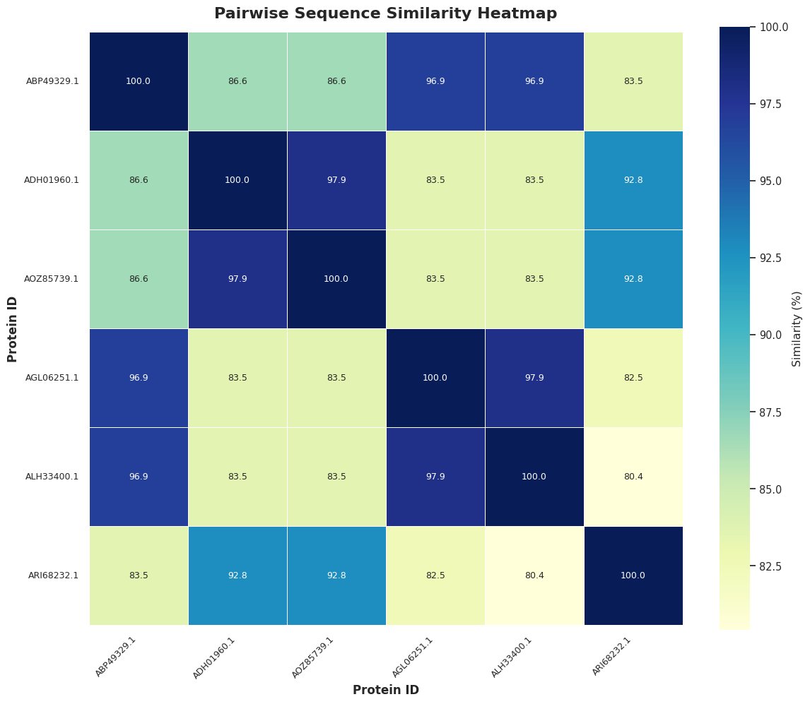
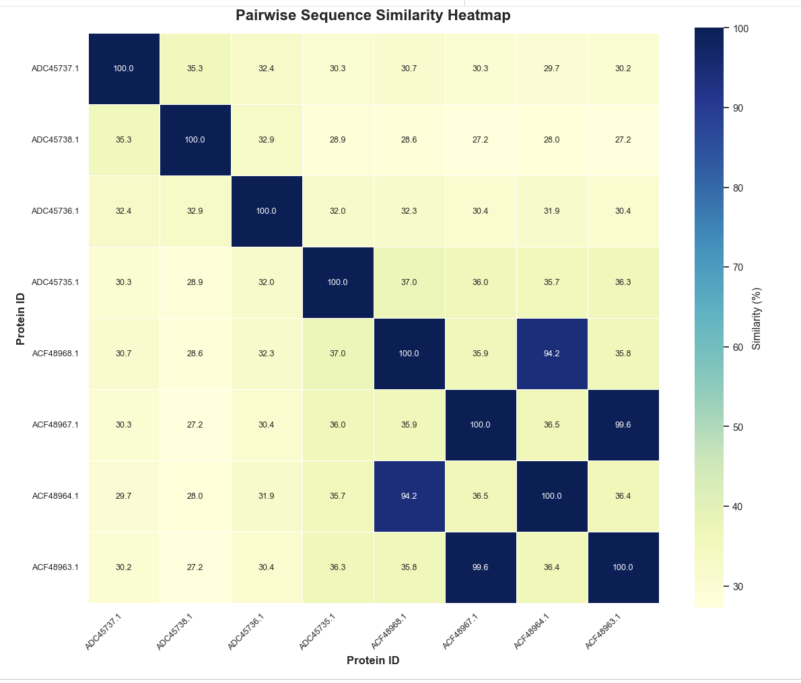

# Examples

## Example from Mahdis's FASTA File

If you use this sequence file, you will get the results below.

[Download the FASTA file used for these results](https://github.com/luquelab/Environmental-Group/blob/main/docs/mcrA.fasta)

These are mcrA protein sequences from methanogens, microorganisms that generate methane. The mcrA gene is a key marker for methanogenesis.

## Pairwise Sequence Similarity Heatmap

## Dendrogram Based on Physicochemical Properties

## Dendrogram Based on Sequence Similarity

## Dendrogram Based on Combined Information

## Example from Wenyu's FASTA file

If you use this sequence file, you will get the results below.

[Download Wenyu's FASTA file](https://github.com/luquelab/Environmental-Group/blob/main/docs/Wenyu_Norovirus_VP1_combined.fasta)

These are VP1 protein sequences from norovirus. VP1 is the major capsid protein and plays an important role in viral structure and classification. These sequences were used to compare sequence similarity and visualize clustering patterns among different norovirus samples.

## Pairwise Sequence Similarity Heatmap

## Dendrogram Based on Physicochemical Properties

## Dendrogram Based on Sequence Similarity

## Dendrogram Based on Combined Information

## Example from Amin's FASTA file

If you use this sequence file, you will get the results below.

[Download Amin's FASTA file](https://github.com/luquelab/Environmental-Group/blob/main/docs/Amin_m2_H1N1_H3N2.FASTA)

This project focuses on the M2 protein of Influenza A virus, comparing H1N1 and H3N2 sequences using sequence-based and physicochemical analyses, followed by alignment and structural visualization. Amin chose M2 because it is small, structurally interesting, and biologically important. It acts as a proton channel during viral entry and uncoating, and its tetrameric arrangement makes it a good target for both sequence and structural analysis.

## Pairwise Sequence Similarity Heatmap

## Dendrogram Based on Physicochemical Properties

## Dendrogram Based on Sequence Similarity

## Dendrogram Based on Combined Information

## Example from Emma's FASTA file

If you use this sequence file, you will get the results below.

[Download Emma's FASTA file](https://github.com/luquelab/Environmental-Group/blob/main/docs/Emma.fasta)

Enterobacteria phage T7 sequences

## Pairwise Sequence Similarity Heatmap

## Dendrogram Based on Physicochemical Properties

## Dendrogram Based on Sequence Similarity

## Dendrogram Based on Combined Information

