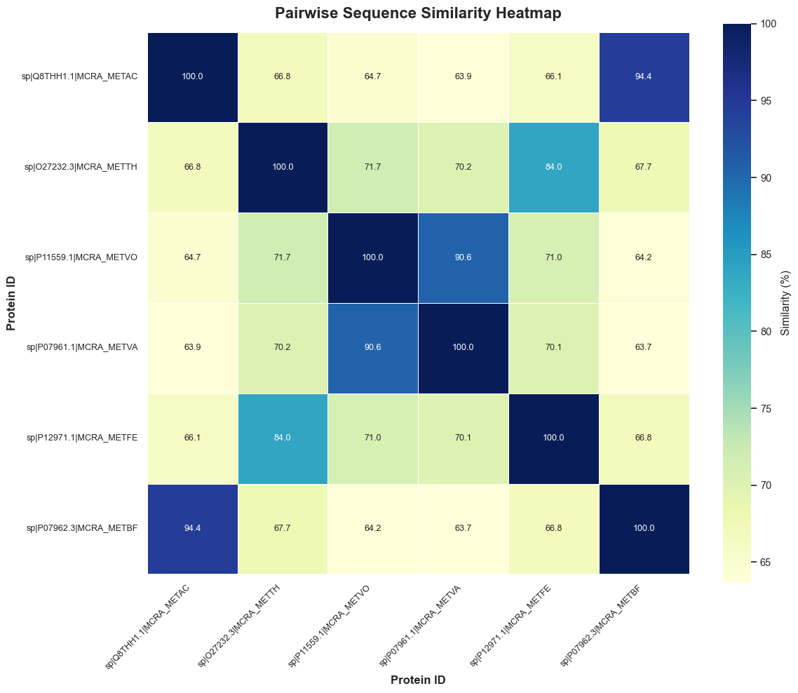
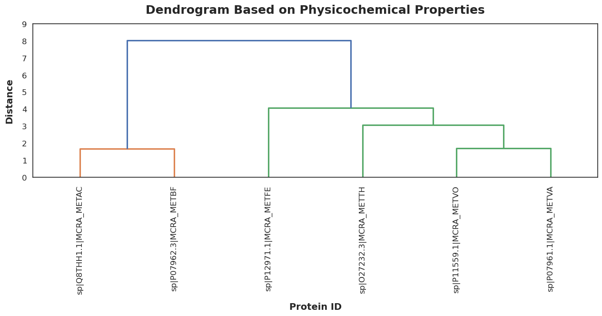
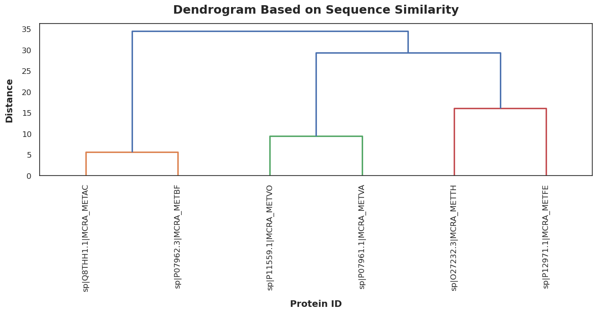
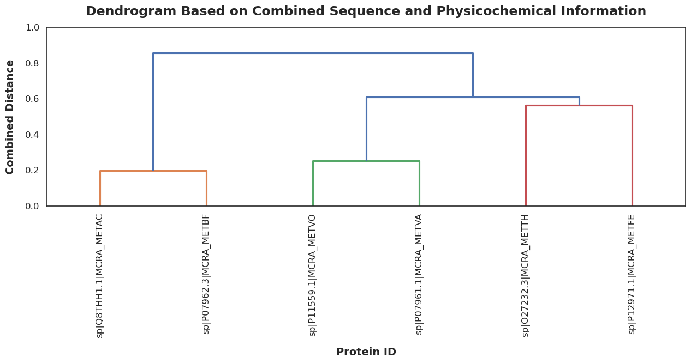
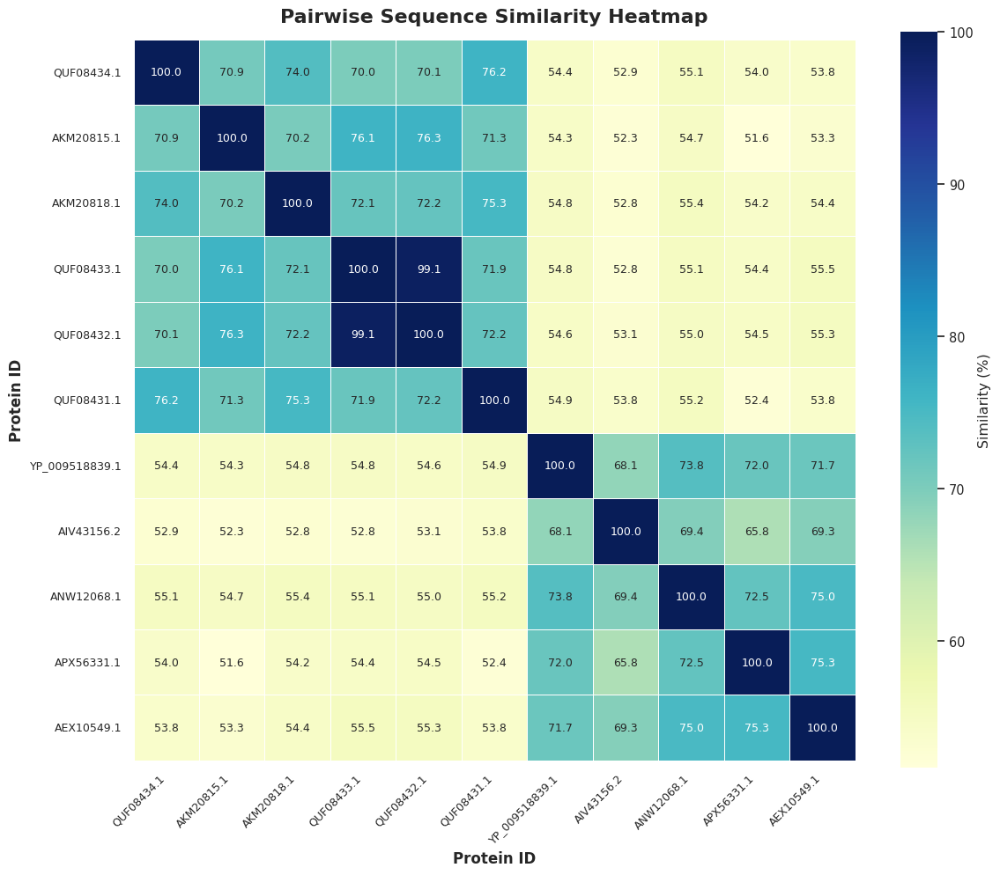

# Visualizations

## Example from Mahdis's FASTA File

[Download the FASTA file used for these results](https://github.com/luquelab/Environmental-Group/blob/main/docs/mcrA.fasta?raw=1)
If you use this sequence file, you will get the results below.

## Pairwise Sequence Similarity Heatmap

## Dendrogram Based on Physicochemical Properties

## Dendrogram Based on Sequence Similarity

## Dendrogram Based on Combined Information

## Example from Wenyu's FASTA file

[Download Wenyu's FASTA file](https://github.com/luquelab/Environmental-Group/blob/main/docs/Wenyu_Norovirus_VP1_combined.fasta?raw=1)
If you use this sequence file, you will get the results below.

## Pairwise Sequence Similarity Heatmap

## Dendrogram Based on Physicochemical Properties

## Dendrogram Based on Sequence Similarity

## Dendrogram Based on Combined Information

## Example from Amin's FASTA file
